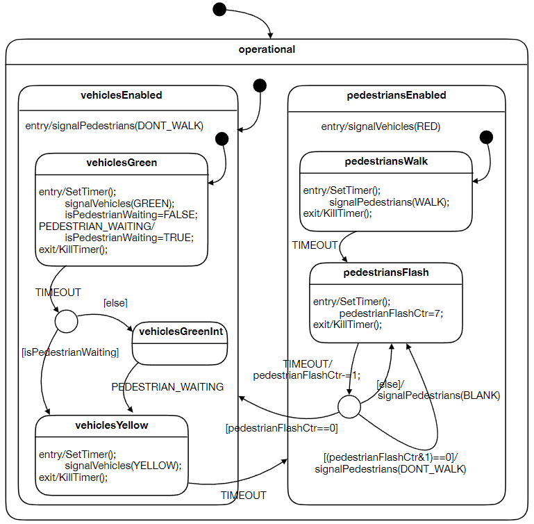
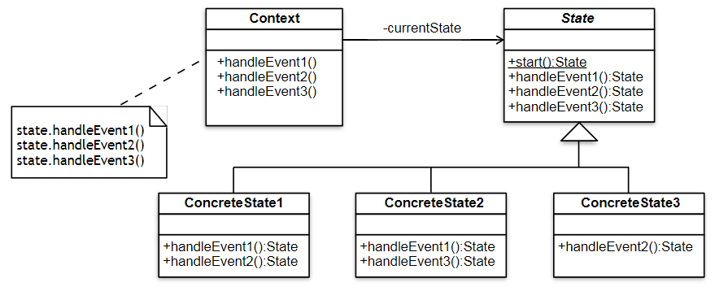

# SYSC 3303 Assignment 3

Joseph Vretenar 101234613

## Pelican State Machine
The Pelican (**Pe**destrian **Li**ght **Con**trolled crossing) state machine is a simple state machine that controls the traffic lights at an intersection.


The code pattern follows the state pattern, where the state class has concreteStates that react to the events that occur in the system.


## Files
### [Context.java](src/PELICAN/Context.java)
The context of the state design pattern.

### [State.java](src/PELICAN/State.java)
The state interface for the state design pattern.

### [TestHarness.java](src/PELICAN/TestHarness.java)
The file that will test the Pelican state machine system.

### [Operational.java](src/PELICAN/States/Operational.java)
The superstate of the state machine.

### Vehicle
#### [VehicleEnabled.java](src/PELICAN/States/Vehicles/VehicleEnabled.java)
Implements the state-specific behavior for the Vehicle Enabled state.

#### [Green.java](src/PELICAN/States/Vehicles/Green.java)
The state for the green light as a substate of VehicleEnabled.

#### [GreenInt.java](src/PELICAN/States/Vehicles/GreenInt.java)
The state for the green light interrupt as a substate of VehicleEnabled.

#### [Yellow.java](src/PELICAN/States/Vehicles/Yellow.java)
The state for the yellow light as a substate of VehicleEnabled.

### Pedestrians
#### [PedestrianEnabled.java](src/PELICAN/States/Pedestrians/PedestrianEnabled.java)
Implements the state-specific behavior for the Pedestrian Enabled state.

#### [Walk.java](src/PELICAN/States/Pedestrians/Walk.java)
The state for the walk light as a substate of PedestrianEnabled.

#### [Flash.java](src/PELICAN/States/Pedestrians/Flash.java)
The state for the don't walk light as a substate of PedestrianEnabled.

## Setup Instructions
1. Make sure java is installed on your system
2. Compile the Java files using an IDE or through command lines
3. Run the TestHarness file

## Expected Output
The terminal output should show the current state that the system is in, followed by the entry conditions, commands, and exit conditions.
The output should look like this:
```
STATE: Operational
STATE: VehicleEnabled
-    entry/signalPedestrians(DONT_WALK)
STATE: Green
-    entry/signalVehicles(GREEN)
-    setTimer(10000)
-    isPedestrianWaiting=false
-    exit/stopTimer()
> TIMEOUT
-    [else]
STATE: GreenInt
### PEDESTRIAN_WAITING ###
STATE: Yellow
-    entry/signalVehicles(YELLOW)
-    setTimer(3000)
-    exit/stopTimer()
> TIMEOUT
STATE: PedestrianEnabled
-    entry/signalVehicles(RED)
STATE- Walk
-    entry/signalPedestrians(WALK)
-    startTimer(15000)
### PEDESTRIAN_WAITING ###
-    exit/stopTimer()
> TIMEOUT
STATE- Flash
-    entry/startTimer(1000)
-    walkFlashCounter=7
-    exit/stopTimer()
> TIMEOUT
-    [(pedestrianFlashCtr&1)==0]
-    signalPedestrians(DONT_WALK)
```

## Questions and Answers
1. **There is a defect in the design which will annoy law-abiding pedestrians.**

The defect in the state model is that the system will only exit the green state under vehicles through a TIMEOUT event which will then cycle through
the yellow state (if a pedestrian is waiting) or to the interruptable green state. The solution to this defect would be to modify the initial
TIMEOUT point in the green state to exit upon triggering the pedestrian waiting event. This way the pedestrians are not waiting the entire time duration.

2. **There is a second error in the design.**

The second error in the design is that the timeout event which triggers when transitioning from the flash state should tell the pedestrian to not walk,
instead it sends the blank signal. This means that there is no don't walk signal for pedestrians. The solution would be to modify the state machine
to implement an alternate design to switch to the don't walk state on the exit action of pedestriansEnabled, and one when switching to a red light
for the vehicles.